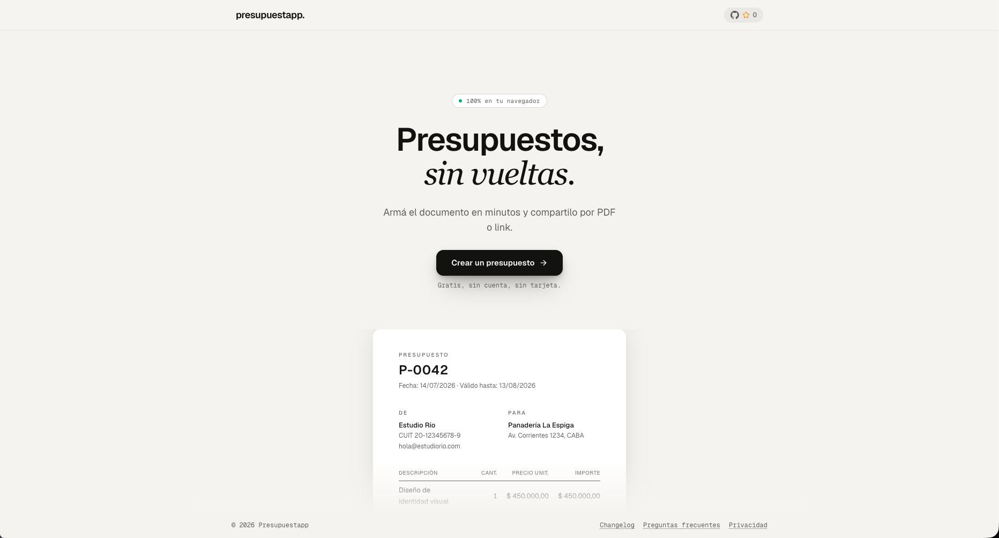
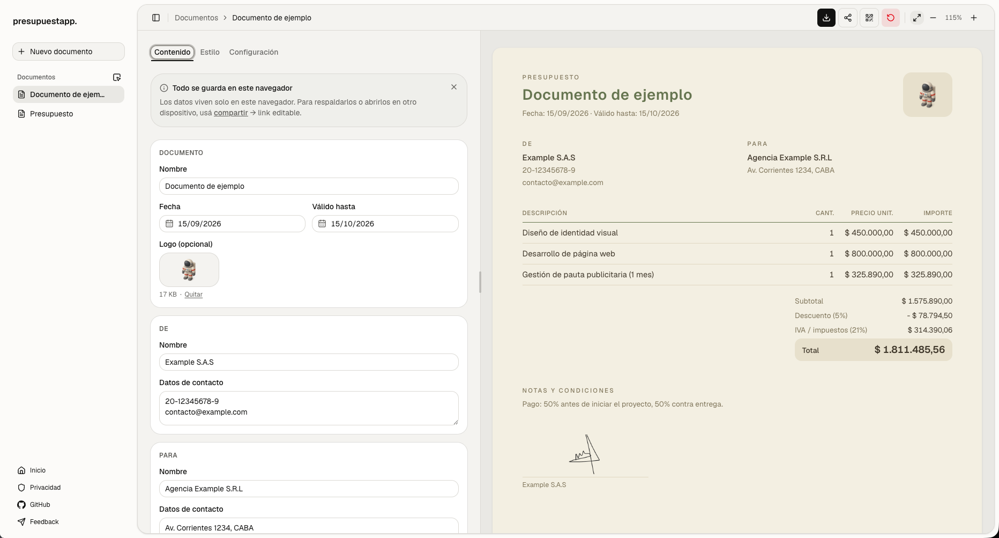

# Presupuestapp

**Presupuestos, sin vueltas.** Armá un presupuesto profesional, exportalo a
PDF y compartilo por link — sin cuenta, sin backend, sin suscripción.


**Idioma:** Español · [English](README.en.md) · [Português (Brasil)](README.pt-BR.md)

## Índice

- [Capturas](#capturas)
- [Por qué existe](#por-qué-existe)
- [Funcionalidad](#funcionalidad)
- [Stack](#stack)
- [Empezar a desarrollar](#empezar-a-desarrollar)
- [Cómo funciona](#cómo-funciona-a-grandes-rasgos)
- [Contribuir](#contribuir)
- [Licencia](#licencia)

## Capturas

| Home | Editor |
| --- | --- |
|  |  |

## Por qué existe

- **Sin cuenta, sin backend.** Cada documento vive únicamente en el
  almacenamiento local del navegador (IndexedDB). No hay servidor que guarde
  ni pueda filtrar los datos de tus clientes.
- **Compartir sin subir nada.** Los links de presupuesto llevan el contenido
  codificado en el propio hash de la URL — nunca pasan por un servidor.
- **Gratis y de código abierto.** Sin límites artificiales ni planes pagos.

## Funcionalidad

- Editor con vista previa en vivo (lo que editás es exactamente lo que se
  imprime/exporta).
- Export a PDF en el navegador, con layouts y tipografías elegibles.
- Compartir por link (con o sin permiso de edición) o por código QR.
- Biblioteca de documentos con selección múltiple, descarga en ZIP y borrado
  en lote.
- Funciona sin conexión una vez cargada la app (todo corre en el cliente).

## Stack

| Categoría | Tecnología |
| --- | --- |
| Framework | [Next.js 16](https://nextjs.org) (App Router) · [React 19](https://react.dev) · TypeScript |
| UI | [Tailwind CSS v4](https://tailwindcss.com) · [shadcn/ui](https://ui.shadcn.com) sobre [Base UI](https://base-ui.com) · [Geist](https://vercel.com/font) · [lucide-react](https://lucide.dev) |
| Documentos y datos | [@react-pdf/renderer](https://react-pdf.org) (PDF en el navegador) · [idb](https://github.com/jakearchibald/idb) (IndexedDB) · [qrcode.react](https://github.com/zpao/qrcode.react) · [JSZip](https://stuk.github.io/jszip/) |
| Calidad | ESLint · Prettier |

## Empezar a desarrollar

Requiere Node 22 (ver `.nvmrc`) y [pnpm](https://pnpm.io) 11.

```bash
pnpm install
pnpm dev
```

Abrí [http://localhost:3000](http://localhost:3000).

Otros comandos:

```bash
pnpm build     # build de producción
pnpm lint      # ESLint
pnpm prettier  # formatear el repo
```

No hay suite de tests ni CI — `lint` y `build` son los únicos gates.

## Cómo funciona (a grandes rasgos)

Presupuestapp es **100% client-side**: no existe backend. El contenido de un
documento vive en el navegador del visitante (IndexedDB) o codificado en el
hash de una URL de share. El PDF se genera en el propio navegador con
`@react-pdf/renderer`. Si querés meterte más a fondo en la arquitectura,
`CLAUDE.md` documenta el modelo de datos, las rutas y las convenciones del
proyecto.

## Contribuir

Ver [`CONTRIBUTING.md`](CONTRIBUTING.md) (en inglés).

## Licencia

Por definir.
